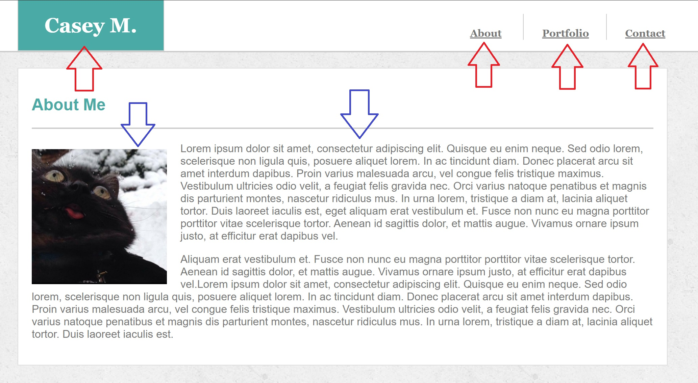

# Basic Portfolio

This small project was no small feat. Being my first class homework assignment in HTML/CSS at UC Berkeley Extension, I encountered many issues that i did not anticipate.

The greatest struggle for this portfolio was the positioning both of/in the Header and the center Sections of each page (along with all of their content). Manipulating different elements within the space proved to be the greatest challenge as I didn't quote grasp the concepts of float, position: static, position: absolute or position: relative. I'd move one element only to find that others had either moved along with it or disappeared behind it. It was quite a challenge. Fortunately, with a great deal of practice, lessons from the course instructor and some helpful tips from a classmate, I mannaged to piece everything together to my liking. I can safely say that i'm a lot more comfortable with HTML/CSS right meow.

For a little more Detail on the challenges mentioned above, i've attached a few images to illustrate what gave me the most trouble...

* 

Above, you'll notice some red arrows pointing to different parts of the header. These parts proved especially difficult to position as they would consistently move with other elements on the page. I also found that each would have to be its own element which further challenged the process of positioning.

The Blue arrows are part of the main Section that gave me trouble. While items of the Header proved a challenge for constantly changing in positon, these elements were difficult in that i could hardly position them at all as most attempts let to zero reaction. This was where the long hours of practice and playing around with different tools eventually came in handy.

* 

In this image above, the purple arrows are referring to text boxes that i encountered a great deal of trouble with. Initially, i consulted Google but the result led to an odd placement of the elements within the Section and a random teal box-like object appearing right in the center of the page. The cause of this object is still unknown to me as it disappeared once the proper techniques were used.

## Built With

* [HTML](https://developer.mozilla.org/en-US/docs/Web/HTML)
* [CSS](https://developer.mozilla.org/en-US/docs/Web/CSS)

## Deployed Link

* [See Live Site](https://casey-moldavon.github.io/basic-portfolio/)

## Authors

*Casey Moldavon

- [Link to Portfolio Site](https://casey-moldavon.github.io/basic-portfolio/)
- [Link to Github](https://github.com/casey-moldavon)
- [Link to LinkedIn](https://www.linkedin.com/in/casey-moldavon-442a1761/)

## License

This project is licensed under the MIT License 

## Acknowledgments

* I would definitely like to acknowledge Dexter Valencia who helped me out a lot specifically with the 3rd page (Contacts). He showed me quite a few useful methods of approach and, working with him on in-class activities, we both learned a great deal more on css positioning.
* I would also like to achnowledge the class instructor Jerome Chenette, as none of this would have been possible without his lessons, guidence and support.
